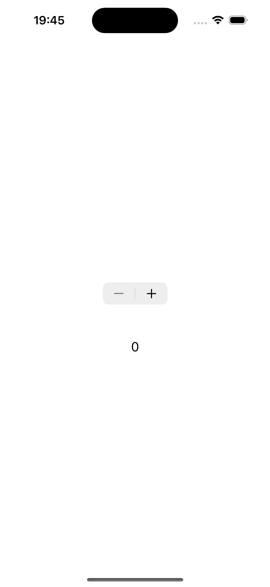
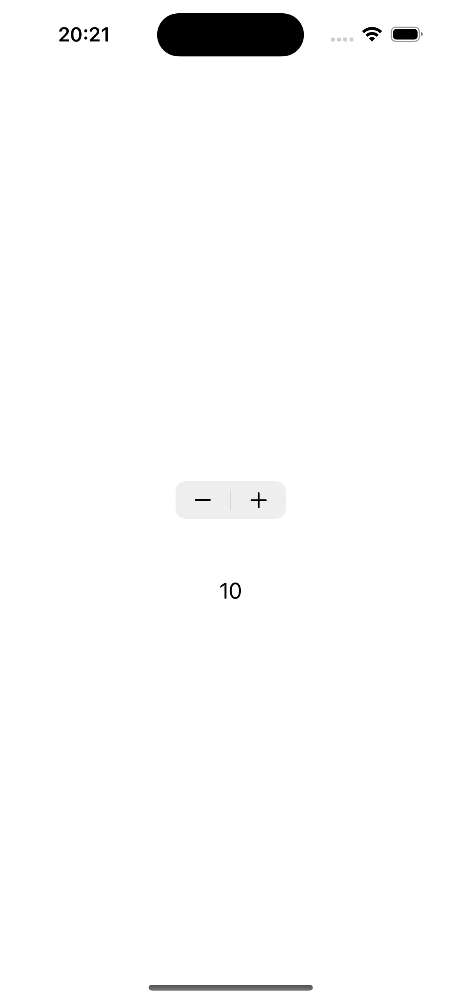

# 📱 Swift Stepper 🚀  

Um projeto simples e elegante que demonstra o uso do `UIStepper` no iOS, permitindo aumentar ou diminuir valores de forma intuitiva.  

## 🏗 Sobre o Projeto  

Este projeto apresenta uma interface minimalista com um `UIStepper` integrado, onde o usuário pode incrementar ou decrementar um valor exibido na tela. Ideal para quem deseja aprender sobre `UIStepper` e sua implementação no **UIKit**.  

## 📌 Funcionalidades  

✔️ Controle de valores numéricos com `UIStepper`  
✔️ Atualização dinâmica do valor na interface  
✔️ Interface minimalista e intuitiva  

## 🛠 Tecnologias Utilizadas  

💻 **Swift 5**  
📱 **UIKit**  
⚙️ **Auto Layout**  

## 📸 Demonstração  

| Tela 1 | Tela 2 | Tela 3 | Tela 4 |
|--------|--------|--------|--------|
|  |  |  | 

## 🚀 Como Rodar o Projeto  

 **Clone o repositório:**  

git clone https://github.com/Mikaelmendonca/Swift-Stepper.git

